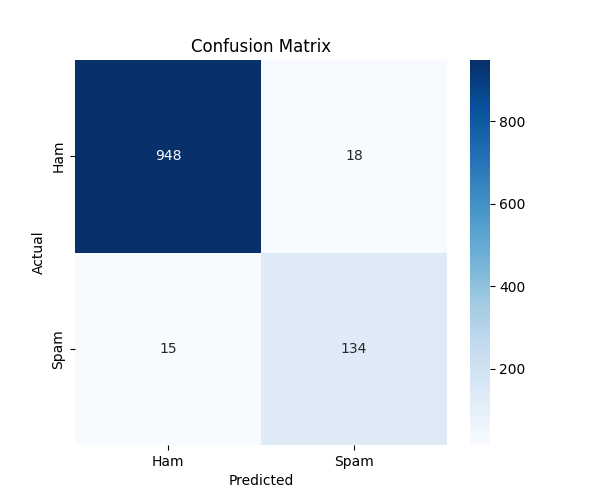

# 📧 SMS Spam Detection (Advanced)

An advanced machine learning pipeline that classifies SMS messages as **Spam** or **Ham** with **95%+ accuracy**, using multiple models, SMOTE balancing, and a Streamlit web app.



---

## 🚀 Live Demo

👉 Try the app here: [https://sms-spam-detector-kb98vmxzj65ttuffy6h56dsyvu55.streamlit.app/](https://sms-spam-detector-kb98vmxzj65ttuffy6h56dsyvu55.streamlit.app/)


---

## 🎯 Features

- ✅ Advanced text preprocessing (lemmatization, stopwords, URL removal)
- ✅ TF-IDF with n-grams (1,2)
- ✅ SMOTE for handling class imbalance
- ✅ Comparison of 4 models: Naive Bayes, SVM, Logistic Regression, Random Forest
- ✅ Hyperparameter tuning with GridSearchCV (5-fold CV)
- ✅ Confusion matrix + classification report
- ✅ Interactive Streamlit web app

---

## 🧠 Tech Stack

- Python 3.10+
- Pandas, NumPy
- Scikit-learn (TF-IDF, SVM, NB, LR, RF, GridSearch)
- Imbalanced-learn (SMOTE)
- NLTK (lemmatization, stopwords)
- Streamlit (deployment)
- Joblib (model persistence)
- Matplotlib & Seaborn (visualization)

---

## 📂 Dataset

- **Name:** SMS Spam Collection
- **Source:** [UCI ML Repository](https://archive.ics.uci.edu/ml/machine-learning-databases/00228/smsspamcollection.zip)
- **Size:** 5,574 messages
- **Classes:** Ham (~86%) / Spam (~14%)

---

## 📊 Results

| Model                | Accuracy | F1-Score |
|----------------------|----------|----------|
| Naive Bayes          | ~97%     | ~93%     |
| Linear SVM (tuned)   | **~98%** | **~95%** |
| Logistic Regression  | ~97%     | ~93%     |
| Random Forest        | ~97%     | ~92%     |

**Best model:** Linear SVM (tuned via GridSearchCV)

---

## ⚙️ How to Run Locally

```bash
git clone https://github.com/a-srt343/sms-spam-detection-advanced.git
cd sms-spam-detection-advanced
pip install -r requirements.txt
streamlit run app.py
